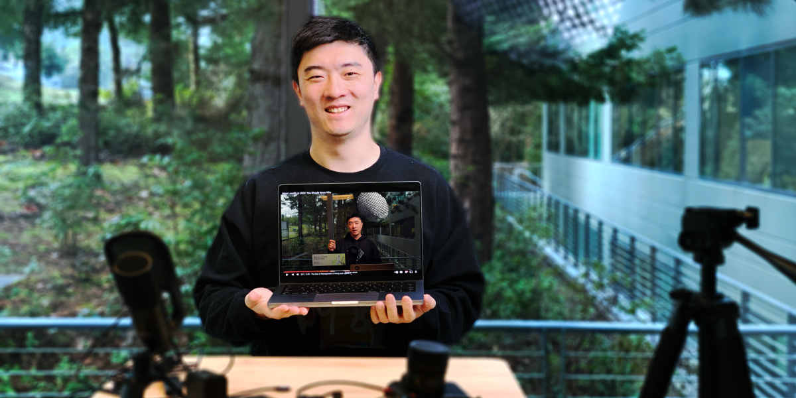

# 为什么我要开一个数据科学YouTube频道

- 原文标题：Why I launched a data science YouTube channel
- 原文链接：https://www.statsig.com/blog/pragmatic-data-science-launch
- 发布日期：2024-02-08
- 作者：Yuzheng Sun（立正）

*原文头图：我拿着电脑，屏幕上是我的一期YouTube视频，前面是录视频用的麦克风和三脚架。*

## 被叫作influencer，听着像在骂人

我们的CEO Vijaye有时候介绍我，会说我是Statsig的influencer，也就是网红。

一开始我听着挺别扭。在数据科学家的圈子里，influencer往好了说是个中性词，更多时候带着点看不起。

这种看不起也有它的道理。

**数据科学是一门严肃的学问。**分析要严谨，要有技术深度，要做深做透。我们抠细节，因为一个很小的细节，常常就能把整个分析的方向翻过来。

网红不一样。他们要讨好的是一大群人，而一大群人通常对深入透彻的分析没兴趣，他们要的是结论、故事和反转。

说白了，最好的网红都很会做标题党。

所以我身边不少同事和朋友觉得，网红看重的是名气和流量，不是真相；为了多一点曝光、多几个订阅，可以把观点拧歪。总的来说，网红不太被当回事。

那我算哪一种？

## 数据科学扎手的地方

先说清楚，我们不是工程师。数据科学家的影响要通过别人实现：合作方、跨职能的同事，还有最终拍板的人。分析做得再好，没让决策变好，就没有用。

可大家对数据的误解太多了。某种程度上，我们每个人都和互联网上的普通观众差不多：耐心有限，注意力有限，脑力也有限。我们追故事，要结论，对细节多少都会觉得无聊。

所以你会看到这种现象：一家公司明明有很好的数据科学，决策还是很糟。人人都夸数据驱动决策，真正做对的很少。

这些年我见过太多数据科学家，无奈地想说服合作方睁眼看看数据到底在说什么，想拿出更好的方法，想纠正错误，然后一次又一次受挫，甚至挨批。

### 冲突躲不掉

我在这一行看到的是：数据分析的质量，和公司决策的质量之间，隔着一道很大的鸿沟。

打个沉重点的比方。食物银行把没人吃的食物捐给挨饿的人，他们最大的抱怨永远是：因为分发环节出问题，大量食物白白浪费，而明明有那么多挨饿的人用得上。

这太可惜了。

数据科学也是一样。人才和洞察都不缺，甚至是过剩的，可就是产生不了影响，公司和决策者最后还是按别的因素去定目标、做决策。

这件事得有人正面去解决。得有人先抓住大家的注意力，再把基本概念一遍一遍地讲，讲到大家真正内化为止。这不是看不起谁，人就是这么学东西的。

## 为什么我做了Pragmatic Data Scientists

在这场冲突里，数据科学家自己也不无辜。

很多时候，我们知道自己是对的，也知道对方为什么错、错在哪儿。但到了某个时候，我们认定对方不会听，就放弃了说服。

有时候是自尊心，有时候是坚持不下去，有时候是潜意识里怕被证明自己错了。这几样，我们哪一样都承受不起。

这就是我开这个频道的原因，也是Statsig愿意让我把很大一部分时间投进来的原因，这些时间本来可以花在改进我们的产品上。

我相信，一个产品能做多大，取决于它解决的问题有多大。可很多人还没意识到这个问题已经有了解法，更多的人还没意识到这里有个问题。

## 跟实战派一起做

大多数数据科学教育都围着工具转。

渔夫只能靠打鱼变得更会打鱼，猎人只能靠打猎变得更会打猎。同样，光在学校里学模型，成不了好的数据科学家。这门手艺要在解决真实问题的过程中学。

最好的知识，来自在实际应用里练出来的高手。

**这个频道最重要的一根支柱，就是向这些高手学习，再把他们的知识和故事分享出来。**

下面是到目前为止我最喜欢的几期视频，也是几次合作。

### 留存：一个有用、清楚的定义

视频：[Retention: A useful and clear definition](https://www.youtube.com/watch?v=mqlHpYimik8)

这期讲的是「留存」这个概念里容易被忽略的细节，也讲了初级和资深数据科学家对这个词的理解差在哪里。

留存分析比看上去复杂。它牵涉三段关键的时间：起始的时间段，结束的时间段，以及两者之间的间隔。这三段不定义清楚，分析就很容易被误读，各方也很容易对不上。

视频给了一套定义留存的框架：把两段活跃时间和中间的间隔都说死，消除歧义。我用一个假设的ChatGPT用户留存的例子，演示同一个留存问题可以有几种不同的理解，以及为什么定义必须精确。

这期对我很重要。在Facebook的时候，不同团队对留存的定义各不一样，这让大家看到必须有一套统一的做法，后来公司内部专门做了一次统一留存定义的工作。

### 怎样升到资深数据科学家

视频：[How to get promoted as a senior data scientist](https://www.youtube.com/watch?v=eni8iVE7kXE)

这期我采访了John Meakin，Meta的Senior Staff Data Scientist。他的职业发展非常快，进Meta的头两年里升了两次。

John把自己的成功归到几件事上：持续投入，对自己负责的领域理解得很深，做出了大的影响，以及建立了牢固的关系。他强调要抓住机会，也要懂得应对升职这件事本身的门道。

他特别讲到把工作记录下来有多重要，以及信任在职业发展里的分量。整场对话里，他给了不少实用的建议：专注并深耕自己的领域，借助mentor成长，学会识别并抓住大的机会。

他也分享了怎样靠坚持克服困难，怎样说服持怀疑态度的人，怎样从过去的经历里学习，以及升职这件事里的种种细节。

我很喜欢这次对话，因为它讲到了「做出影响」和「表现出升职需要的行为」之间的平衡，也说明了一致性和热情在一个人的职业道路上有多重要。

### 2024年，数据工程师要解决哪些问题？

视频：[What problems will data engineers solve in 2024?](https://www.youtube.com/watch?v=gZP1ltN7Z7M)

这期的嘉宾Pushpendra是一位资深数据工程师，有15年经验，待过咨询公司、Amazon AWS和Statsig，他分享了这一路积累的经验。

Pushpendra讲了在不同的工作环境里做数据工程有什么不同，比较了大科技公司和创业公司。我们聊了数据建模的演变，以及维持数据质量这个关键挑战。他特别强调，公司文化会在很大程度上影响这两件事。

他还强调，技术选型要和业务需求对齐，要在处理海量数据和应对业务复杂度之间找到平衡。

最后，Pushpendra谈了针对具体业务做数据建模这个专门的领域，以及技术进步怎样改变了这件事。整场对话把数据工程的核心组成、它在今天技术版图里的位置，以及它面临的挑战和机会，都聊得很深。

我选这期，是因为它对数据工程的洞察很到位。不管做了几年数据工程，我觉得这些内容都用得上。

## 谢谢

借这个机会，我想真心感谢每一位愿意给我的视频一个机会的人。作为一个把数据科学当职业的人，这个话题我非常在乎，你们的支持对我意义重大。

接下来，我唯一的目标就是做出更好的内容，更正面地去解决更多问题，把数据科学教给尽可能多的人。

你非要管这叫「当网红」，也行。
