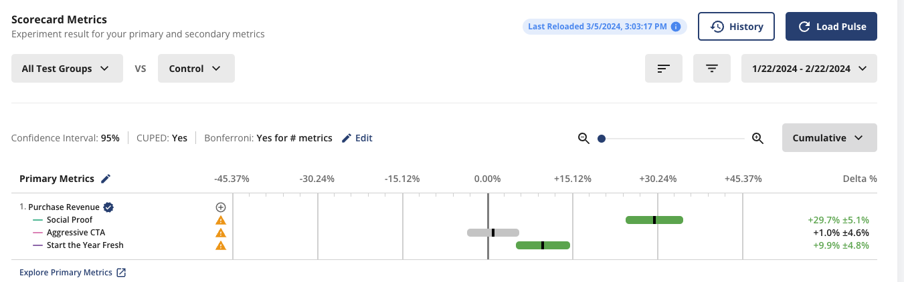
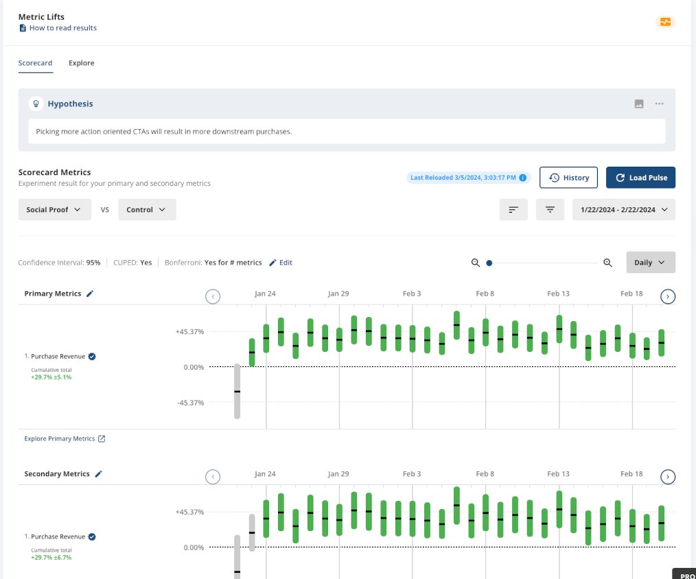
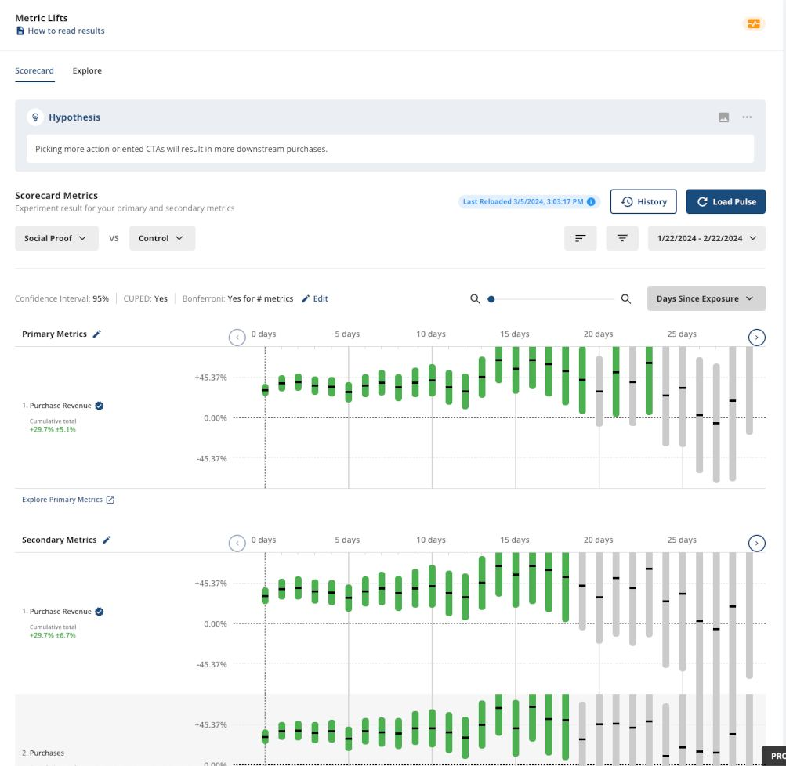

# 关于新奇效应，你需要知道的都在这里

- 原文标题：Novelty effects: Everything you need to know
- 原文链接：https://www.statsig.com/blog/novelty-effects
- 发布日期：2024-03-20
- 作者：Yuzheng Sun（立正）

## 先说结论

- 新奇效应（novelty effect）指的是：一个新功能刚出来时，用户的反应因为「新」而暂时偏离了它本来的价值。
- 不是所有产品都有新奇效应，它主要出现在高频使用的产品里。
- 如果忽视「新奇效应只是暂时的」这一点，可能做出错误的产品决策，更糟的是带出坏的文化。
- **新奇效应本身就是处理效应（treatment effect）的一部分**，不应该用统计方法去「修正」它。
  - 发现和控制新奇效应最有效的办法，是看**处理效应的时间序列**。
  - 治本的办法，是用一组能正确反映用户意图的指标。
- 理解对了、用对了，新奇效应还能帮你。

## 什么是新奇效应

新奇效应，是产品指标上一种短期的变化，原因是你引入了某个新东西。简单说，新东西会引起一阵暂时的反应，新鲜感过去，这阵反应可能也就过去了。

产品决策要看指标怎么动，所以必须理解这个现象，只把产品改动带来的持续影响算进去。

新奇效应不是坏事，有时候还很有价值。

## 新奇效应该怎么看

对新奇效应一种常见的错误处理，是把它当成统计误差或者偏差。它不该用统计方法去修正，那样做只会带来更多错误的决策。

我们在实验里研究的，就是处理本身的效果：一个新功能，一个不同的按钮，或者一个不同的流程。新奇效应是这个处理效应的一部分，所以从**统计**上讲，新奇效应没有任何问题。

那为什么在产品实验里，新奇效应被认为有风险？因为我们不只是在估计「观察到的处理效应」。我们要拿实验结果去做产品决策，这一步是在**推断和外推**，Tom Cunningham对这一点有[很好的总结](https://tecunningham.github.io/posts/2023-04-18-experiment-interpretation-extrapolation.html)。

换句话说，如果一个实验的结果主要由新奇效应主导，你又想拿它去外推长期影响，结论多半是错的。

通常，在短期里，新奇效应比功能本身的效果强得多，而且只在短期里是这样。想象一下：你每天路过的一家餐厅，菜单、厨师、服务全都提升了一倍，你可能根本注意不到。可它要是改了个名字，你会好奇，想进去看看发生了什么。

### 忽视新奇效应会怎样

负责任的老板不会为了多拉点客人，隔一周就给餐厅换个名字。但如果你手下有几百家餐厅，给每个店长定的季度KPI是每天的到店人数，谁拉的客人最多，谁的奖金最高呢？

店长们会更愿意去改店名，而不是改菜单。这条路容易，而且立竿见影地「有效」。人会对激励做出反应。大家在乎KPI，新奇效应又能带来快速的胜利，那它**很可能就会被拿来完成KPI**。

### 新奇效应的坑

到这里，我们已经确定了两件事：

1. 新奇效应是处理效应的一部分，所以没有一种通用的统计方法能把它检测出来；
2. 新奇效应很危险，你不去对付它，它就会蔓延。

实际上，只要理解到位，新奇效应通常很容易发现，也很容易控制。

有些时候，新奇效应被错误处理的根源，是用了过于简单的OEC（overall evaluation criteria，综合评估标准），并且**依赖短期指标**，比如点击率（CTR）。

CTR作为指标本身没有错，但要明白，CTR衡量的东西很多。CTR上升可能意味着：1）用户发现了价值；2）用户被新鲜感吸引；3）用户被误导性的内容骗了点击，等等。所以CTR上升并不总是好事。

解决办法是在OEC里加入其他指标来补充CTR。比如功能级别的漏斗和功能级别的留存，能告诉我们用户有没有按我们设想的那样把功能用完，以及他们会不会再回来用这个功能。

## 在时间序列里看新奇效应

用统计检验来解决新奇效应，很诱人，但一般不建议这么做。我们再回到新奇效应的定义：

*新奇效应指的是：一个新功能刚出来时，用户的反应因为「新」而暂时偏离了它本来的价值。*

关键词是「**暂时**」。时间足够长，新奇效应就会消退。

我们看一个实验的观察效应时，看的是累计效应：在整个实验期内累计计算的实验组和对照组之间的差值。

*图1　实验结果的累计视图（Cumulative）。这是Statsig实验结果页的截图：一个示例实验在2024年1月22日到2月22日之间，三个实验组相对对照组在Purchase Revenue（购买收入）上的累计差值和置信区间。*

用累计效应下结论，统计功效（power）更高。如果预期的处理效应不随时间变化，这样做没问题；但有新奇效应时，情况就不是这样了。有新奇效应的时候，哪怕是CTR这样的短期指标，在新鲜感过去之后表现也会不一样。所以我们应该换个角度，看处理效应的每日视图：

*图2　处理效应的每日视图（Daily）：同一个实验里「Social Proof」组对比对照组，每天单独计算的Purchase Revenue差值和置信区间。原文这两张截图的图注写反了，这里按截图实际内容标注。*

或者看「距首次曝光天数」的视图（days since exposure）：

*图3　距首次曝光天数的视图（Days Since Exposure）：把用户按「第一次进入实验之后的第几天」对齐，看每一天的处理效应。越往右，曝光够久的用户越少，置信区间越宽，结果也越不显著（灰色）。*

新奇效应的**必要**条件是：**短期效应和长期不一样，而且会随时间消退。**你通常会看到CTR的每日差值一开始比较高，然后降下来，并且一直维持在低位。但有些改动也可能反过来。比如Facebook把按时间排序的News Feed（EdgeRank）换成机器学习排序的News Feed时，[用户一开始的反应并不友好](https://www.linkedin.com/pulse/evolution-facebooks-old-algorithm-edgerank-michael-glasek-%E7%8E%8B%E6%98%8A%E6%98%8E-fnqic/)。

## 怎样稳妥地控制新奇效应

靠肉眼看数据下结论，有两个问题：

1. 空想性错觉（apophenia），也就是人爱在随机里找规律的偏差，会骗你得出本来不存在的结论；
2. 统计功效不够。

所以，把处理效应的暂时偏离判定为新奇效应，要谨慎。好在忽略这些偏离的代价不高，所以我们建议：

1. 在实验结果里用「距首次曝光天数」的视图，找出疑似有新奇效应的指标：CTR这类浅层指标，短期和长期的表现不一样；
2. 你认为结果可能被新奇效应驱动的头几天数据，直接扔掉；
3. 用剩下的数据做实验决策，我们认为这段时间里的效应已经收敛到一个均衡的长期值。

### 别草木皆兵

新奇效应是一种奢侈品。用户要感到「新奇」，得先对你的产品体验有预期，而大多数生意并不是这样。用户能察觉到体验变化的产品，新奇效应才会表现得最明显。这是好事。

另一块拼图是改动的幅度。对麦当劳来说，改一下界面未必会引起新奇效应，但McRib（猪肋排汉堡）重新上架大概率会。所以简单的公式是：

`新奇效应 ∝ 意外程度 × 使用频率`

想再仔细一点，可以按使用频率给用户分桶。使用频率越高的用户，越可能出现新奇效应。另外，新用户不太会有新奇效应；但这个逻辑反过来不成立：如果一个功能对老用户有影响、对新用户没影响，你不能据此说这是新奇效应，因为新用户和老用户之间天生就有太多不同的因素。

延伸阅读：[CUPED explained](https://www.statsig.com/blog/cuped)

## 利用新奇效应

记住，新奇效应只是人性带来的心理效应，它是处理的一部分。那为什么不用它呢？比如：

- 把更多流量引向你的战略性动作，比如机器学习排序的News Feed；
- 和其他活动（横幅、促销、广告）配合，放大你要传达的信息；
- 为功能上线设计一套组合打法，比如一开始用新用户引导（NUX）解释这次改动；
- 用历史实验为新奇效应建立先验。

原则是：作为产品数据科学家，你的工作是让产品和生意变得更好，而不是为了回答假想的问题去设计实验。学习很重要，但别去学没用的东西。如果你能用自己的知识设计实验，让生意更成功，那就去做。
