# 四步讲清楚假设检验

- 原文标题：Hypothesis Testing explained in 4 parts
- 原文链接：https://www.statsig.com/blog/hypothesis-testing-explained
- 发布日期：2024-07-22
- 作者：Yuzheng Sun（立正）

做数据科学的人，按理说都应该把假设检验理解透，现实中往往不是这样。主要原因是，我们的教科书把两套思路不一致地混在了一起：一套是p值和显著性检验，一套是假设检验。

比如下面这些问题，如果你之前没有专门想过，答案并不显然：

- power或者β，取决于原假设吗？
- 我们能「接受」原假设吗？为什么？
- 保持β不变，MDE会怎样随α变化？
- 为什么假设检验里用的是标准误，而不是标准差？
- 为什么我们不能把备择假设定得具体一点，好好地给它建模？
- 为什么假设检验最根本的权衡是「犯错」和「发现」之间的权衡，而不是α和β之间的权衡？

把这些讲清楚并不容易，假设检验这个话题本来就绕。这篇文章会一步步引入10个概念，配上可视化和直观的解释。读完以后，你应该能从第一性原理上真正想明白上面这些问题，也能把这些概念给你的合作方讲清楚。

**文章分四部分：**

1. 用几个核心的统计概念把问题设定好，再把它们和假设检验连起来，在技术上正确和简单易懂之间找平衡。具体来说：
   1. 把标准差和标准误清楚地区分开，并说明为什么假设检验用的是标准误；
   2. 把什么时候可以「接受」一个假设、什么时候应该说「无法拒绝」而不是「接受」、以及为什么，讲完整。
2. 借助**原假设**，引入**α、第一类错误**和**临界值**；
3. 借助**备择假设**，引入**β、第二类错误**和**power**；
4. 通过**power计算**，引入**最小可检测效应（MDE）**以及各个因素之间的关系，最后做一个总结，并给一些实践建议。

## 第一部分：假设检验、中心极限定理、总体、样本、标准差和标准误

做假设检验，我们从**原假设**开始。原假设一般是说实验组和对照组之间没有效应，最常见的写法是：实验组和对照组的均值之差为0。

**中心极限定理**告诉我们这个均值之差的一个重要性质：只要样本量足够大，不管总体原本是什么分布，这个均值之差背后的分布都会近似于正态分布。这里有两点要注意。

第一，实验组和对照组的总体分布可以各不相同，但只要样本量够大，观察到的均值（也就是你观察很多个样本、算出很多个均值）总是服从正态分布。下面这张图里，n=10和n=30两行对应的就是样本均值背后的分布。

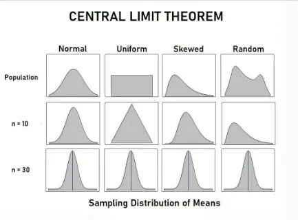

*图1　中心极限定理：不管总体是正态、均匀、偏态还是不规则的分布（第一行），样本量为10和30时，样本均值的抽样分布（第二、三行）都越来越接近正态分布。图片来源：[一篇Medium文章](https://medium.com/@amanatulla1606/python-implementation-of-central-limit-theorem-exploring-sample-data-to-infer-population-595e39e0c98e)，原文引用。*

第二，注意「背后的分布」这几个字。标准差和标准误是两个很容易混的概念，我们先把它们分清楚。

### 标准差和标准误

先声明原假设：没有处理效应。为了简单，我们假设下面这个均值为0、标准差为1的正态分布，代表在原假设成立时，所有可能的结果和它们各自的概率。

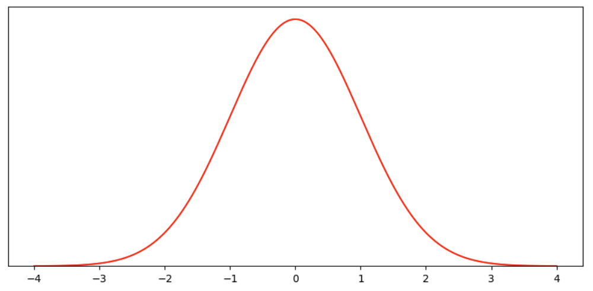

*图2　原假设下的「背后的分布」：均值为0，标准差为1。*

总体、样本、组、估计量，这些说法很容易把人绕晕。所以还是为了简单，我们暂时忘掉「原假设讲的是均值的估计量」这件事，就当这个「均值假设」可以被观察一次，也可以被观察很多次。观察很多次，就形成了一个样本\*，我们的目标是根据这个样本做决策。

> \*给技术读者的注：严格地说，一次观察对应的是一个样本，很多个样本组成一个组，两组之间的差异才是我们说的「均值假设」的分布。红色曲线代表这个差异的估计量的分布，然后我们可以再有一个由这个估计量的很多次观察组成的样本。用我简化后的语言说：红色曲线是估计量的分布，带样本量的蓝色曲线是对它的重复观察。如果你有更好的说法，既准确又不让人困惑，欢迎告诉我。

这条概率密度函数的意思是：从这个分布里抽一次，结果可能落在横轴上的任何位置，纵轴是它落在那里的相对可能性。

如果我们抽**很多次**，这些观察就组成一个**样本**。样本里的每一次观察都服从这个**背后的分布**的性质：更可能靠近0，落在两边的可能性一样大。正的和负的会互相抵消，所以**这个样本的均值**会更集中在0附近。

我们用标准误来表示「样本均值」的误差：

标准误 = 观察样本的标准差 / √样本量

样本量为30时，标准误大约是0.18。和背后的分布相比，样本均值的分布要窄得多。

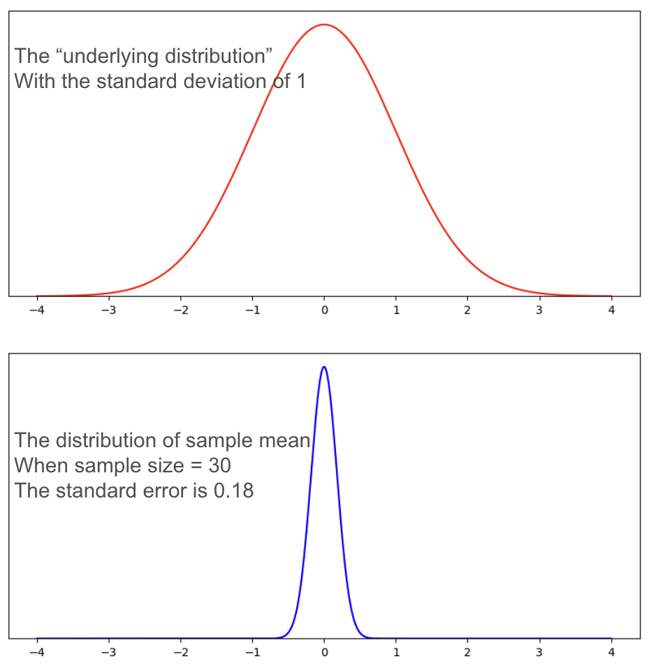

*图3　上：背后的分布，标准差为1。下：样本量为30时样本均值的分布，标准误为0.18，窄得多。*

假设检验要做的，是根据一个样本得出结论：到底有没有处理效应？所以当我们谈**α和β，也就是第一类错误和第二类错误的概率**时，我们谈的是**基于样本均值和标准误画出来的那个分布上的概率**。

## 第二部分：原假设、α和临界值

第一部分说过，**原假设**最常见的写法是：实验组和对照组的均值之差为0。

不失一般性\*，我们假设原假设背后的分布是均值0、标准差1：

- 那么在原假设下，样本均值的均值是0，标准误是1/√n，n是样本量；
- 样本量为30时，这个分布的标准误约为0.18，长下面这样。

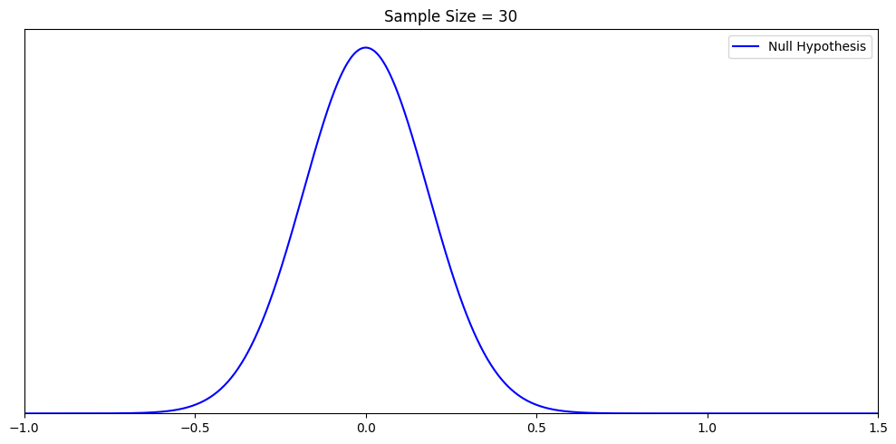

*图4　样本量为30时，原假设下样本均值的分布。*

> \*给技术读者的注：原假设说的是均值之差，但这里为了不把事情搞复杂，我们做了一个小小的替换，直接画「均值之差的估计量」的分布。下面所有的讨论，说的都是这个估计量。

我们之所以要设一个原假设，是因为要做判断，尤其是判断处理效应到底存不存在。但在概率的世界里，任何观察、任何样本均值都可能出现，只是概率不同。所以我们需要一条决策规则，帮我们把犯错的风险量化出来。

决策规则是这样的：设一个阈值。样本均值高于这个阈值，就拒绝原假设；低于这个阈值，就接受原假设。

### 「接受」一个假设，还是「无法拒绝」一个假设

你可能听过一句话：「我们从来不接受一个假设，只是无法拒绝它。」听完潜意识里可能还有点糊涂。深层的原因是，现代教科书把Fisher的显著性检验和Neyman-Pearson的假设检验这两套定义不一致地混在了一起，还忽略了一些重要的前提（[参考](https://en.wikipedia.org/wiki/Statistical_hypothesis_test)）。把它讲清楚：

- 首先，不管有什么观察，我们都永远无法「证明」某一个具体的假设。因为给定一个观察，可能为真的假设有无穷多个，只是概率不同。第三部分会把这一点画出来。
- 其次，「接受」一个假设，不代表你相信它，只代表你按它为真来行动。所以从技术上讲，「接受」一个假设没有任何问题。
- 但是第三，当我们谈p值和置信区间的时候，「接受」原假设往好了说也是让人困惑的。原因是，「p值高于阈值」只意味着我们没能拒绝原假设。在严格的Fisher p值框架里，根本没有备择假设。拒绝原假设有一条清楚的标准（p < α），但并没有一条同样清楚的、基于β的标准来「接受」原假设。

所以，**在p值的语境里**说「接受一个假设」，危险在于：

1. 很多人会把「接受」原假设误读成「证明」了原假设，这是错的；
2. 「接受原假设」没有严格的定义，也不对应这个检验的目的。检验的目的是判断要不要拒绝原假设。

这篇文章会始终待在**Neyman-Pearson框架内部**，保持一致。在这个框架里，「接受」一个假设是合法的，也是必要的。否则，不先假定某个假设为真，我们连一个分布都画不出来。

你不需要知道Neyman-Pearson这个名字，也能看懂下面所有内容。但请留意我们的用词，每个词都是为了避免错误和混淆而仔细挑过的。

到这里，我们搭了一个简单的世界：只有一个假设是唯一的真相，还有一条决策规则，带来两种可能的结果。一种是「原假设为真时拒绝了它」，另一种是「原假设为真时接受了它」。两种结果的可能性，都来自原假设为真时的那个分布。

后面引入备择假设和MDE的时候，我们会逐步走进有无穷多个备择假设的世界，也会把「为什么无法证明一个假设」画出来。

p值/显著性框架和假设检验框架之间的区别，留到另一篇文章，到时候你会看到完整的图景。

### 第一类错误、α和临界值

有了标准误，我们就能画出原假设下样本均值的分布。因为在我们这个世界里只有原假设这一个真相，所以我们只可能犯一种错：原假设为真时，错误地拒绝了它。这就是**第一类错误**，犯这种错的概率叫**α**。假设我们希望α是5%，就可以算出需要的阈值，这个阈值叫**临界值**。下面是用样本量30进一步画出来的图。

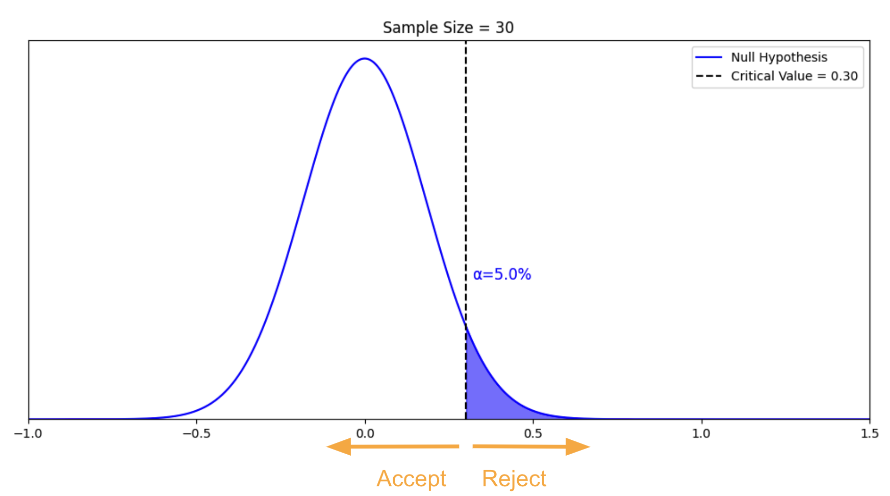

*图5　样本量为30时，α=5%对应的临界值是0.30。样本均值落在0.30左边就接受原假设，落在右边就拒绝原假设；蓝色阴影的面积就是α。*

图里，α是曲线下蓝色的面积，临界值是0.3。如果样本均值高于0.3，我们就拒绝原假设，犯第一类错误的概率是5%。

小结一下：

- **第一类错误**：原假设为真时，错误地拒绝了原假设；
- **α**：犯第一类错误的概率；
- **临界值**：决定是否拒绝原假设的那个阈值。

## 第三部分：备择假设、β和power

你可能注意到了，第二部分只讲了第一类错误：原假设为真时拒绝了它。那第二类错误呢？原假设不为真时，却错误地接受了它。

问题是，除非我们知道真相是什么，否则说「接受」是错的，就有点奇怪。所以我们需要一个备择假设，充当另一个可能的真相。

### 备择假设是一种理论构造

有一个重要的概念，大多数教科书都没有强调：对一个给定的原假设，备择假设可以有无穷多个，我们只是从中挑了一个。没有哪一个比其他的更特殊，或者更「真」。

用一个例子画出来。假设我们观察到的样本均值是0.51，那真正的备择假设是哪一个？

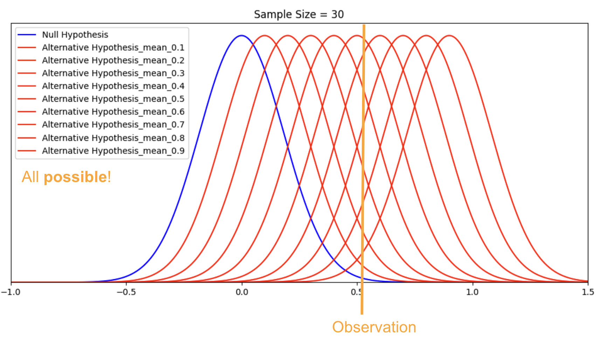

*图6　样本量为30时，观察到的样本均值约为0.51（橙色竖线）。蓝色是原假设，红色是均值从0.1到0.9的一系列备择假设：它们都有可能是真的。*

从图上能看出为什么说「有无穷多个备择假设」：给定这个观察，可以为真的备择假设（再加上原假设）有无穷多个，每一个的概率不同。有的可能性大一些，但每一个都有可能。

记住，备择假设是一种理论构造。我们挑一个具体的备择假设，是为了计算某些概率。到这里，你应该更能理解为什么给定一个观察，我们没法「接受」原假设：我们无法证明原假设为真，只能说，在这个观察和事先定好的决策规则下，我们没能拒绝它。

「从无穷多种可能里只挑一个备择假设」这件事，等讲MDE的时候会完整地圆回来。「接受」和「无法拒绝」的区别还有更深的一层，这篇文章不展开，留到讲p值和置信区间的文章里。

### 第二类错误和β

为了简单、方便对比，我们挑一个均值为0.5、标准差为1的备择假设。样本量还是30，标准误约为0.18。现在，我们这个简单的世界里有两个可能的「真相」。

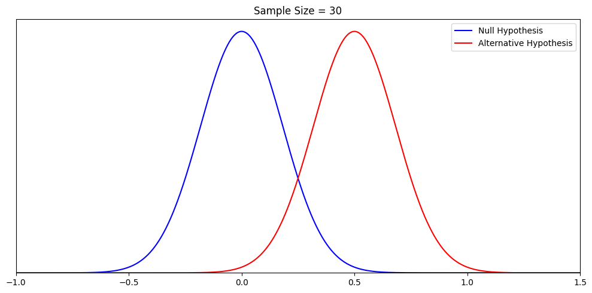

*图7　样本量为30时，原假设（蓝）和均值为0.5的备择假设（红）。*

回忆一下，在原假设下我们希望α是5%，对应的临界值是0.30。现在把决策规则改成：

- 如果观察值高于0.30，我们拒绝原假设，**并且接受备择假设**；
- 如果观察值低于0.30，我们接受原假设，**并且拒绝备择假设**。

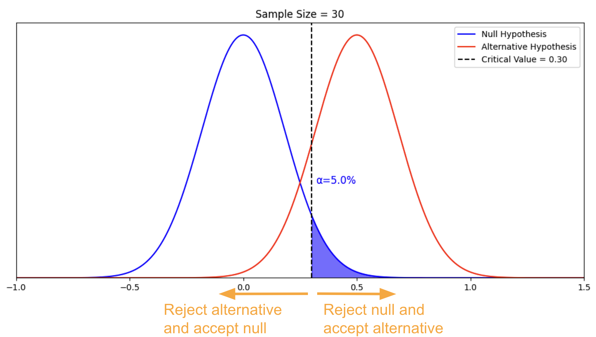

*图8　同样以0.30为临界值：左边是「拒绝备择假设、接受原假设」，右边是「拒绝原假设、接受备择假设」。*

有了备择假设这个另一种「（假设的）真相」，我们就可以把「接受原假设、拒绝备择假设」称为一种错误，也就是第二类错误，还能算出犯这种错的概率。这个概率叫β，就是下图红色的面积。

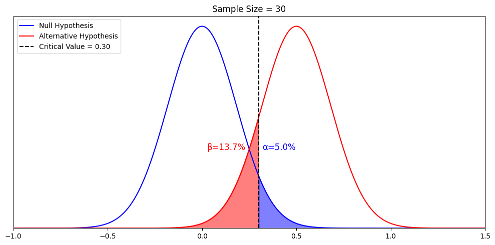

*图9　临界值0.30时，α=5.0%（蓝色面积），β=13.7%（红色面积）。*

从图上可以看出，β取决于备择假设和临界值。这两个关系都很重要，我们一个一个、非常明确地讲。

第一，β怎样随备择假设的均值变化。我们换一个均值为1的备择假设，代替刚才的0.5：

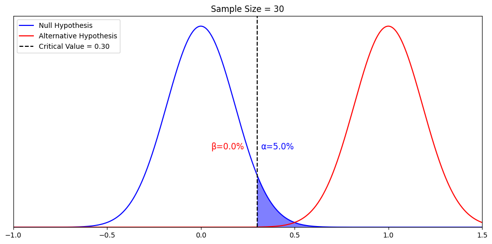

*图10　备择假设的均值换成1以后，在同样的临界值0.30下，β从13.7%变成了0.0%。*

β从13.7%变成了0.0%。也就是说，β是在我们假定某个特定的备择假设为真时，错误地拒绝它的概率。假定另一个备择假设为真，就会得到另一个β。所以严格地说，β只描述一件事：**一个特定的备择假设为真时，错误地拒绝它的概率**，别的什么都不描述。只有在一些其他条件下，「拒绝备择假设」才意味着「接受」原假设，或者「无法接受原假设」。这一点在讲p值和置信区间的文章里再展开。但到目前为止讲的内容都是对的，用来理解power已经够了。

第二，α和β之间有关系。给定原假设和备择假设，α决定临界值，临界值又决定β。这就是「犯错」和「发现」之间的权衡：

- 如果我们容忍更大的α，临界值就会更小；在β不变的情况下，我们能检测到更小的备择假设；
- 如果我们容忍更大的β，同样也能检测到更小的备择假设。

一句话：**我们愿意容忍更多的错误（不管是第一类还是第二类），就能检测到更小的真实效应。犯错和发现之间的权衡，才是假设检验最根本的权衡。**

所以，容忍更多的错误，换来更多发现的机会。这就是第四部分要展开的MDE。

终于可以定义power了。power是统计检验里一个重要又基础的概念，我们用三种方式来理解它。

### 理解power的三种方式

第一，power的技术定义是1−β。它表示：给定一个备择假设，再给定原假设、样本量和决策规则（α = 0.05），我们接受这个特定备择假设的概率。就是下图黄色的面积。

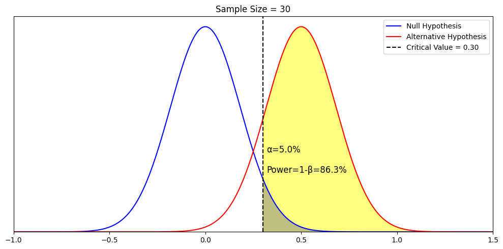

*图11　样本量为30、α=5%时，对均值为0.5的备择假设，power = 1−β = 86.3%（黄色面积）。*

第二，power的含义其实很直观。举个现实的例子：你想知道全世界最受欢迎的汽车品牌是哪个。如果我只看到一辆车、一个牌子，我的观察就没什么power；如果我看了一百万辆车，我的观察就很有power。一个有power的检验，意思是：真实效应存在时，我有很大的机会把它检测出来。

第三，为了把这两层意思一起讲清楚，我们只做一个改动：把样本量从30增加到100，看power怎样从86.3%升到接近100%。

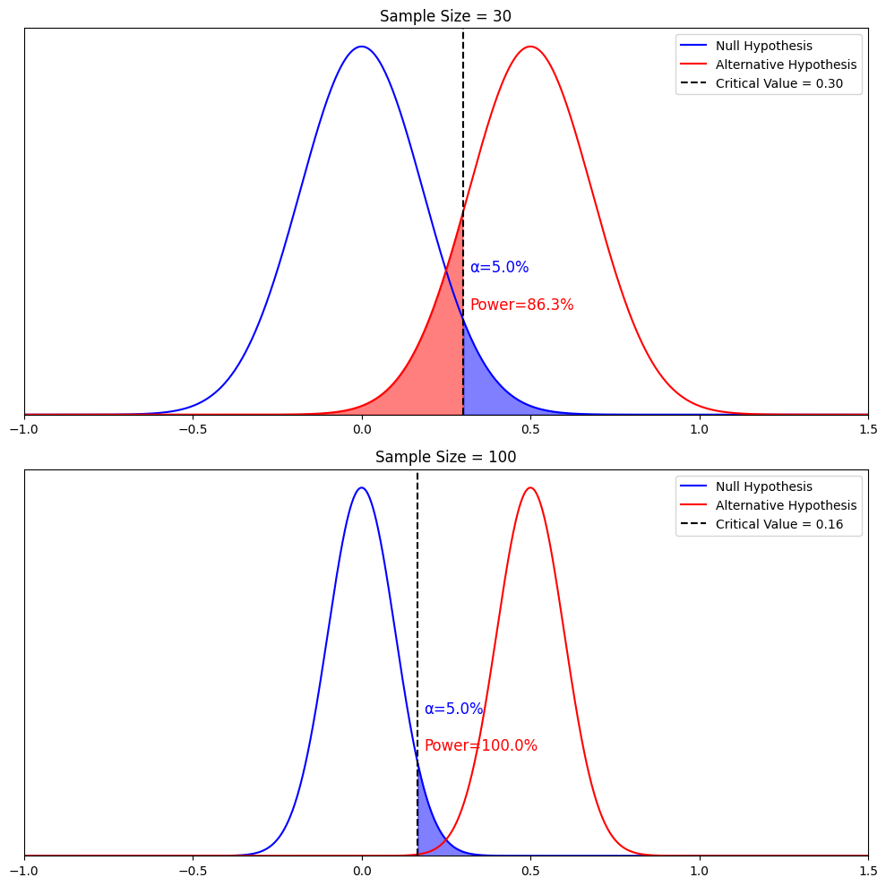

*图12　上：样本量30，临界值0.30，power为86.3%（红色阴影是β）。下：样本量100，两个分布都变窄，保持α=5%，临界值降到0.16，power接近100%（图中显示为100.0%）。*

从图上很容易看出，**power随样本量增加而增加**。原因是样本均值估计得更准了，原假设和备择假设的分布都变窄了。**两类错误都更不容易犯了**：保持α=5%不变，临界值可以从0.30降到0.16；对同一个备择假设，第二类错误也几乎没有了。

小结一下：

- **第二类错误**：备择假设为真时，没能拒绝原假设；
- **β**：犯第二类错误的概率；
- **power**：真实效应存在时，检验把它检测出来的能力。

## 第四部分：power计算和MDE

### MDE、备择假设和power之间的关系

现在可以处理所有定义里最微妙的那个了：最小可检测效应（minimum detectable effect，MDE）。先用一条红色的点划线，把备择假设的样本均值在图上标出来。

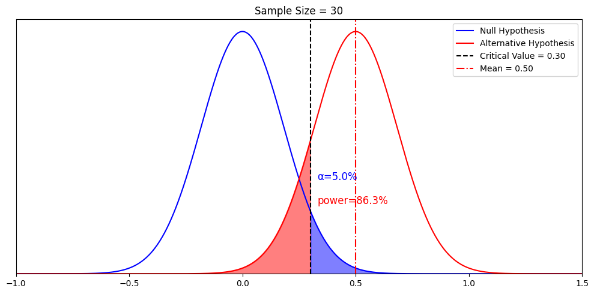

*图13　样本量为30时，均值为0.50的备择假设对应的power是86.3%。*

如果样本量不变，但我们希望power正好是80%呢？这时候要想起前面说的：「备择假设是一种理论构造」。我们可以换一个对应80% power的备择假设。算一下就会发现，它是均值为0.45的那个备择假设（标准差仍然保持为1）。

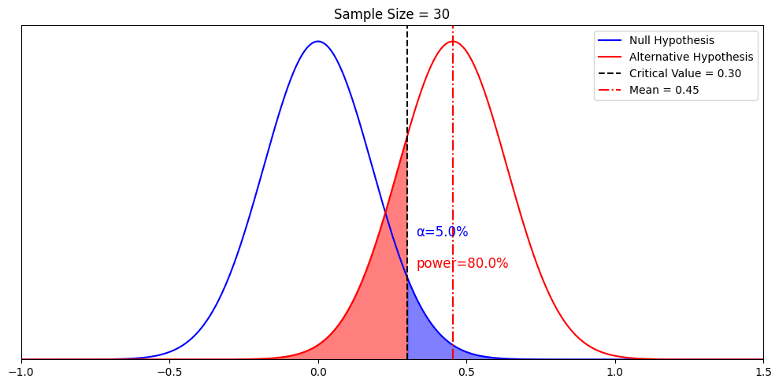

*图14　样本量为30、α=5%时，均值为0.45的备择假设对应的power正好是80%。*

到这里，「无穷多个备择假设」和「最小可检测效应」这两个概念就接上了。记住，在统计检验里，我们希望power越大越好。「**最小**可检测效应」里的「**最小**」，指的是能让power达到80%的那个备择假设均值的最小值。均值在MDE右边的任何一个备择假设，都能给我们**足够**的power。

换句话说，在均值0.45的右边，确实有无穷多个备择假设。均值恰好为0.45的这一个，是power刚好够用的最小值。我们把它叫作最小可检测效应，也就是MDE。

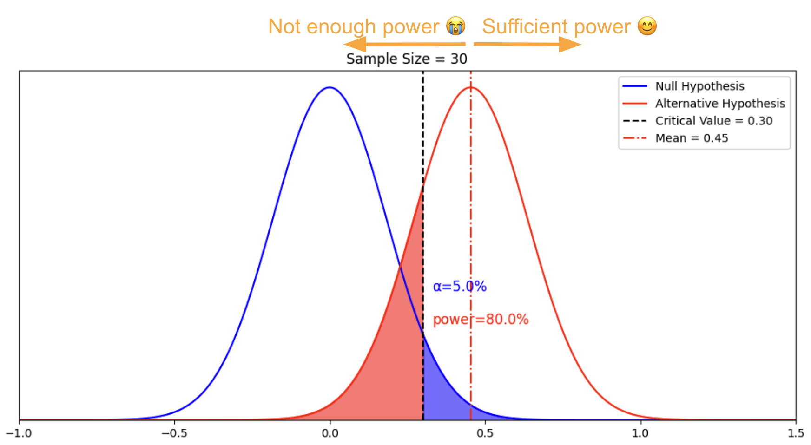

*图15　以均值0.45为界：备择假设的均值落在它左边，power不够；落在右边，power足够。*

### 从头完整地推一遍MDE

我们把MDE是怎么推出来的，从头走一遍：

- 固定原假设下样本均值的分布，固定样本量，于是能画出蓝色的分布；
- 决策规则要求α为5%，推出临界值应该是0.30；
- 固定备择假设为标准差为1的正态分布，于是标准误是0.18；它的均值可以在任何位置，因为备择假设有无穷多个；
- 决策规则要求β不超过20%，也就是power不低于80%；
- 推出在这条决策规则下，我们能检测到的备择假设观察均值的最小值是0.45。任何高于0.45的值，power都足够。

### MDE怎样随样本量变化

最后把所有东西串起来：保持α和β不变，增加样本量，看MDE怎么变。

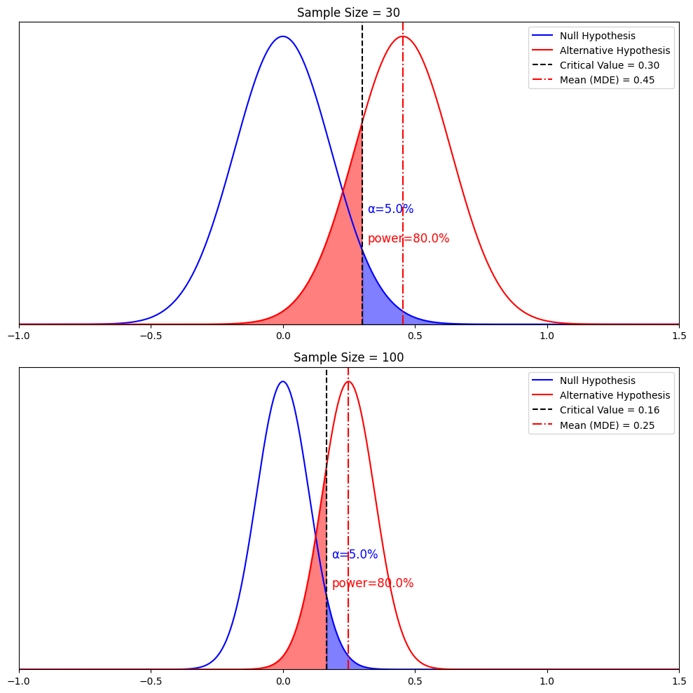

*图16　保持α=5%、power=80%不变，样本量从30增加到100：临界值从0.30降到0.16，MDE从0.45降到0.25。*

1. 样本均值的分布变窄，再保持α不变，临界值从0.3降到0.16；
2. 再保持β不变，MDE从0.45降到0.25。

这是另一个关键结论：**样本量越大，能检测到的效应越小，MDE也越小。**

这个结论对统计检验非常重要。它意味着，即使一家公司的样本量不大，只要处理效应够大，A/B实验也能可靠地把它检测出来。

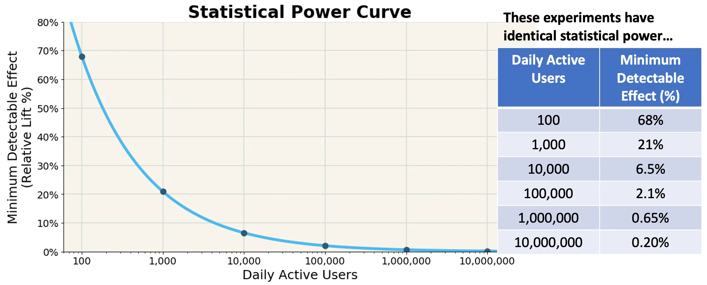

*图17　统计功效曲线：同样的统计功效下，日活用户数和MDE（相对提升）的对应关系。日活100时MDE为68%，1,000时为21%，1万时为6.5%，10万时为2.1%，100万时为0.65%，1,000万时为0.20%。*

## 总结

把所有概念放在一起回顾一下。

假设原假设为真：

- **α**：原假设为真时，拒绝它的概率；
- **临界值**：决定拒绝还是接受原假设的阈值。

假设某个备择假设为真：

- **β**：这个备择假设为真时，拒绝它的概率；
- **power**：真实效应能产生显著结果的概率。

power计算：

- **最小可检测效应（MDE）**：给定样本量和分布，能让我们达到期望的α、并且power足够的备择分布均值的最小值（通常α = 0.05，power ≥ 0.8）；
- **各因素之间的关系，其他条件不变时**：样本越大，power越大；样本越大，MDE越小。

我们讲的所有内容，都在Neyman-Pearson框架之下。在这个框架里，根本不需要提p值和显著性。把两套框架混在一起，是教科书带来的不一致。怎样把这种不一致讲清楚，又怎样正确地把两者结合起来，是另一个话题了。

### 实践建议

就这些。但这只是开始。实践里，用好power还有很多讲究，比如：

- 为什么偷看结果（peeking）会带来行为上的偏差，怎样用序贯检验（sequential testing）来纠正；
- 为什么多重比较会影响α，怎样用Bonferroni校正；
- 样本量、实验时长和实验流量分配之间是什么关系；
- 把流量分配当作实验的资源来管理：理解交互效应什么时候没问题、什么时候有问题，以及怎样用分层（layers）来管理；
- 设定MDE时的实际考虑。

另外，上面的例子里我们把分布固定住了，但现实中，分布的方差起着很重要的作用。方差有不同的计算方法，也有不同的降低方法，比如CUPED，或者分层抽样。

相关资源：

- 样本量不均匀分配时怎样计算power：<https://blog.statsig.com/calculating-sample-sizes-for-a-b-tests-7854d56c2646>
- 实际应用：<https://blog.statsig.com/you-dont-need-large-sample-sizes-to-run-a-b-tests-6044823e9992>
