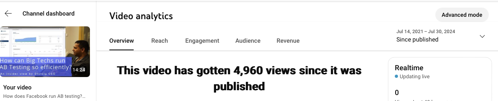

# Meta怎样把我变成了A/B实验的铁杆支持者

- 原文标题：How Meta made me a big-time A/B testing advocate
- 原文链接：https://www.statsig.com/blog/meta-a-b-testing
- 发布日期：2024-09-10
- 作者：Yuzheng Sun（立正）

三年多以前，我录了[Statsig的第一个公开演示视频](https://youtu.be/QB3GEnduxk4)。

我一直想让看我视频的数据科学家们看看Deltoid有多强。可Deltoid是Facebook的内部工具，不允许对外展示。

听说[Statsig做了一个公开版的Deltoid](https://www.statsig.com/blog/why-we-started-statsig)，我非得展示一下不可。

*图1　那期视频的YouTube后台截图：「How can Big Techs run AB Testing so efficiently? An insider view by Statsig CEO」，从发布到2024年7月30日共有4,960次观看。*

我这么急着展示Deltoid，是因为我相信它是Facebook的产品和文化的根基，可在别的地方，大家并不怎么理解它。比如在[更早的一期视频](https://youtu.be/ET9D_nildHw)里，我讲过A/B实验怎样塑造了Facebook凭本事说话的meritocracy和竞争文化。在[后来的一次线上分享](https://docs.google.com/presentation/d/1HlDrD22-dKIrn_gQVS9mO7kwHSvMStG_nMNe6BmeeQ4/edit?usp=sharing)里，我的题目是：「数据分析师只有两种：做A/B实验的，和将会变得无关紧要的。」我的信念就是这么强。

塑造这个信念的，是三件事。

## 衡量我们的失败

2020年，Facebook决定发力Shops和电商。Marketplace看起来也是做电商的天然候选，毕竟用户本来就在上面买东西。负责的产品leader来自eBay，我们还从Walmart这样的公司招了团队过来。

各个团队进了作战室，要在Marketplace上做一个电商优先的体验。我是从Amazon过来的，对这件事很兴奋，主动熬了好多个通宵。

第一个在主tab上线的大版本，我们想得很周全：设计现代又简洁，结账流程顺畅，还有专门的团队挑选有吸引力、又和用户相关的商品。我们还用补贴把价格做到和竞争对手一样，退货政策也很宽松。

幸好这次上线我们做了A/B实验，因为它是一场灾难。实验结果让所有人都震惊了，包括我自己。

实验显示，几乎每一个指标都在下降：从商品详情页到结账的转化率，从浏览到商品详情页的点击率，浏览曝光量，还有日活用户数。

结论很清楚：不管我们做了什么，*Marketplace的用户都很讨厌它。*

失败发生的时候，通常有两种可能的原因：要么这个想法本身不成立，要么想法可以成立、但执行得不好。领导们自然会质疑执行。说句公道话，他们也应该质疑，因为我自己也在质疑我们的执行。

### 理解我们的失败

后来，又一个实验救了团队，让大家不用再去追一个没希望的想法，也不用因为没把它做成而受罚。

这个实验设计得很巧，为「电商这个想法在Marketplace上行不通」提供了强有力的证据。实验的假设是：Marketplace的用户来这里，就是专门来捡便宜的；他们对一般的电商商品并没有兴趣。

事后看，这很有道理：能在Amazon上可靠地买到的电商商品，为什么要跑到Facebook上买？问题是，你怎么向那些一心要把电商做成的人证明这一点？

### 一张白底图带来的差别

我们找到的抓手是：大多数「Marketplace原生」的商品，图片都带着真实场景做背景，比如东西就摆在一张桌子上；而大多数电商商品的图片，都是干净、专业的白底图。

于是，对同一批商品，我们随机决定用户在浏览信息流里看到的是白底图还是带场景的图。结果发现，**白色背景导致点击率和转化率下降**：它让用户觉得自己在逛一个传统的电商，而不是在淘便宜货。

再结合我们对这个产品的其他理解，我们很有把握地得出结论：Marketplace的用户就是对电商商品不感兴趣，甚至可能会反感，因为这些商品看起来很像Marketplace上的广告。

*图2　实验的两个版本：同一件商品（30美元的LED光疗面罩），左边是带场景的原生图片，右边是白底图。哪一个更像电商？*

## 如果没有A/B实验

A/B实验的威力，从此一直留在我心里。

白底图实验之前，我在数不清的会议里饱受折磨：争论哪些想法会成，执行不好该怪谁，怎么才能执行得更好。

白底图实验之后，争论很快就平息了。我们把重点重新放到给Marketplace上的本地商品开通邮寄上，**在接下来的半年里，Marketplace上的线上交易增长了26倍**，是Facebook Shops和Instagram Shops加起来的10倍。

没有这两个实验，很多人的日子会难过得多。

在这类故事里，领导有时看起来像反派：战略不对，决策不好，不懂业务，甩锅给下属，等等等等。

但如果诚实地复盘，我自己也是走到半路才转过弯来。埋头想把一个想法做成的时候，人是很难看清现实的。

对我来说，这才是因果证据和A/B实验真正的力量。因为我觉得，就算是扎克伯格本人来说服我，也不会比这更有效。

延伸阅读：[A/B testing 101](http://www.statsig.com/blog/ab-testing-101)
