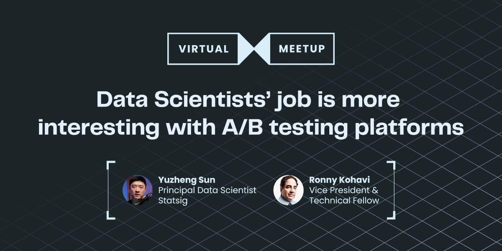
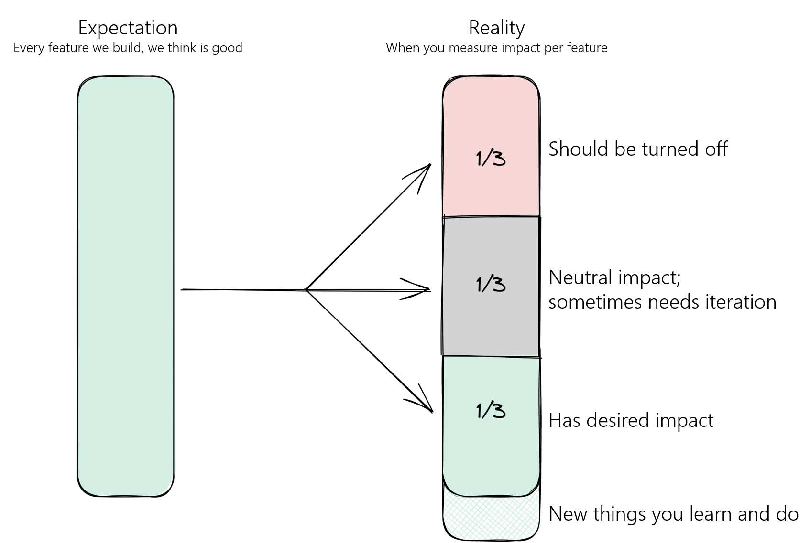

# A/B实验平台怎样让数据科学变得更有意思

- 原文标题：How A/B testing platforms make data science more interesting
- 原文链接：https://www.statsig.com/blog/how-ab-testing-platforms-make-data-science-more-interesting
- 发布日期：2024-10-16
- 作者：Yuzheng Sun（立正）
- 说明：本文是一场线上分享的回顾，分享嘉宾是Ronny Kohavi。文中引号里的原话和他讲的经历属于Ronny；三点收获的总结和评论是立正的。

*原文头图：这场线上分享的宣传海报，题目是「Data Scientists’ job is more interesting with A/B testing platforms」，两位嘉宾是Yuzheng Sun（Principal Data Scientist, Statsig）和Ronny Kohavi（Vice President & Technical Fellow）。*

过去几年，数据科学这一行的格局发生了根本的变化。

A/B实验平台变得非常高效，把设置实验、计算结果、出报告这些繁琐的工作大部分都自动化了。

这个变化有两面。一方面，它**把数据科学家从重复劳动里解放了出来**；另一方面，很多人也开始问：*那我们现在该把精力放在哪里，才能创造更多价值，让自己的职业更进一步？*

所以我们邀请了实验领域最受尊敬的专家之一[Ronny Kohavi](https://www.linkedin.com/in/ronnyk/)，做了一场线上分享，讲讲为什么他认为有了A/B实验平台之后，数据科学的工作反而变得更有意思了。

完整视频在[这里](https://www.youtube.com/watch?v=nLyZ7e4VqKA)，这篇文章分享一下我从这场活动里得到的几个要点。

### 我问Ronny的问题

1. 自从《Trustworthy Online Controlled Experiments》（也就是常说的「河马书」）出版以来，实验自动化发展到了什么程度？
2. 这种自动化对数据科学家的角色有什么影响？
3. 接下来，数据科学家应该把重点放在哪里？
4. 怎样让领导层支持实验？

如果你对这些话题感兴趣，可以看看[他的slides](https://1drv.ms/p/s!AuRxCGEOCRKGoux2TDawQXRGeXIYyg?e=Z2FXqt)。他的完整回答我就不在这里重复了，下面总结三个最重要的收获，再摘几段值得一读的原话和它们的上下文。

## 三个收获

### 实验自动化对数据科学家有直接和间接两种好处

最明显的好处是，自动化把数据科学家从低价值的重复工作里解放了出来。A/B实验基本自动化以后，他们可以专注于更高层次的事情，比如形成业务洞察和制定策略。

间接的好处影响更大。[一个组织一旦形成了实验文化](https://www.statsig.com/blog/product-development-cycle-improvement-guide)，团队会被真实的数据教育得更谦虚，也更愿意接受推翻自己假设的证据。

数据科学家经常抱怨，领导只重视那些支持他们既有看法的数据。可数据真正的力量，就在于改变决策。

要建立这样的数据驱动文化，就得跑更多的实验。

### 实验规模化真正的敌人，是一厢情愿的文化

Ronny分享了一段很能说明问题的经历，来自他在Amazon和Microsoft的时候，这段经历他在[Acquired的一期小节目](https://youtu.be/3zB6Juog7gk?si=gWdWeRuscYzLi1hm)里也讲过。

在Amazon，他发现超过50%的实验都「失败」了，也就是没有带来预期的结果。到了Microsoft，他发现那里的人普遍坚信所有想法都会成功。问为什么，得到的回答是：*「因为我们的PM更好。」*

今天，大多数在跑大规模实验的人都知道，大约80%的假设不会成功。可对没有直接参与实验的人来说，这个现实很难接受，他们更愿意待在一个自己的想法永远正确的泡泡里。打破这种心态，是实现规模化实验的关键。

*图1　预期与现实。预期：我们做的每个功能都是好的。现实：逐个衡量影响以后，大约1/3应该关掉，1/3没什么影响、有时需要继续迭代，1/3达到了预期效果，另外还有一些你在过程中学到并做出来的新东西。*

### 今天，可靠的自动化工具是可以买到的

Ronny在2020年出版《[Trustworthy Online Controlled Experiments](https://www.cambridge.org/core/books/trustworthy-online-controlled-experiments/D97B26382EB0EB2DC2019A7A7B518F59)》的时候，今天这种程度的自动化还不存在。

现在，像Statsig这样的平台提供了完整的解决方案，从[分组](https://docs.statsig.com/statsig-warehouse-native/configuration/assignment-sources/)和[指标计算](https://docs.statsig.com/metrics/how-metrics-work/)，到[序贯检验](https://docs.statsig.com/experiments-plus/sequential-testing/)、[样本比例不匹配（SRM）](https://www.statsig.com/blog/sample-ratio-mismatch)监控、[CUPED](https://www.statsig.com/blog/cuped)和[差异化影响检测](https://www.statsig.com/blog/differential-impact-detection)这些高级功能，都覆盖了。

过去，**公司要想做可靠、成熟的实验，得自己内部搭这些工具**。今天，像Statsig这样的平台往往比大多数内部方案更强大，也更划算，实验自动化比以往任何时候都更容易获得。

## 原话摘录

**「大多数实验，都没能提升它们本来要提升的指标。」**

Kohavi强调了一个反直觉的现实：大多数实验都得不到预期的正向结果。

他没有把这看成挫折，而是强调这样的失败率本来就是创新的一部分。它反映了预测用户行为有多复杂，也说明了实验作为学习和发现的工具有多重要。

**「如果最上面的人不尊重数据，事情就难办了。」**

谈到组织文化，Kohavi指出领导层必须真正接受数据驱动的决策。他提到了[塞麦尔维斯反射（Semmelweis reflex）](https://en.wikipedia.org/wiki/Semmelweis_reflex)：人们倾向于拒绝和既有信念相矛盾的新信息。

没有高层的支持，再扎实的数据也可能推动不了有意义的改变。

**「设计多条路径。评估它们，在其中一些上学会快速失败，在另一些上学会加倍投入。」**

Kohavi主张保持敏捷，不要死守僵化的长期计划。组织应该探索多种方向，快速验证想法，把资源集中到真正有希望的方向上。这样既能加快创新，也能降低建立在未经验证的假设上的风险。

**「数据科学家更有意思的工作之一，是把结果，也就是那些数字和统计，翻译成一个故事。」**

自动化接手的日常工作越多，数据科学家的角色就越在变化。

Kohavi强调了**讲故事的重要性**：让数据对合作方来说看得懂、能行动。围绕数据构建叙事，数据科学家才能更好地影响决策，推动战略层面的事情。

**「一个工程师只要把服务器性能提升10毫秒，就足以覆盖他或她一年的全部成本，还有富余。」**

为了说明小改进能带来多实在的影响，Kohavi举了这个很有力的例子。哪怕是很小的性能提升，也可能带来可观的成本节省，这正说明了持续优化和持续实验的价值。

## 结论

结论很简单：实验自动化对数据科学家是好事，我们应该拥抱它。

如果你想开始，这里有一份[slides](https://docs.google.com/presentation/d/1wg5kU12z5jM-deoRqQln2W_deSlWo-GZ1GTRvYjha9I/edit?usp=sharing)，讲的是怎样在你的组织里设计一套可规模化的实验系统和实验文化。

欢迎在[LinkedIn](https://www.linkedin.com/in/yuzhengsun/)上加我，在[YouTube](https://www.youtube.com/channel/UCDMkAQ8ASnVMVHvnbiGRvvQ)上关注我。我们一起来打这场仗！
