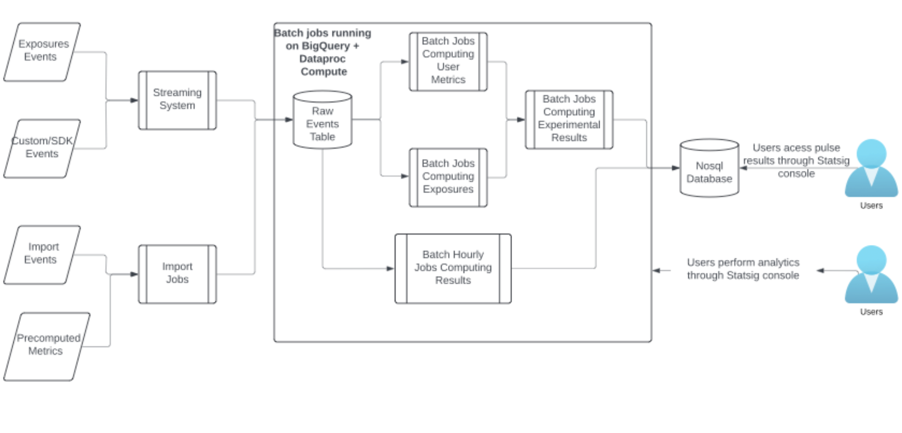

# 实验系统怎样平衡规模、成本和性能

- 原文标题：Balancing scale, cost, and performance in experimentation systems
- 原文链接：https://www.statsig.com/blog/balancing-scale-cost-performance-experimentation-systems
- 发布日期：2025-02-11
- 作者：Pushpendra Nagtode（Statsig数据工程师）、Yuzheng Sun（立正，Statsig数据科学家），按原文署名顺序
- 合著说明：本文是两人共同署名的文章。文中的「我们」指两位作者和他们所在的Statsig团队，文中的观点和经验属于两位作者共同的总结，不应视为立正一人的观点。

A/B实验很容易起步，但如果没有一个设计良好的数据平台，很难规模化。

成本会涨得很快，因为A/B实验里有一个关键又昂贵的步骤：把用户指标和曝光日志合并到一起。

除了成本，设计得不好的系统还容易出错，出了错也很难排查。作为实验平台的提供方，我们托管着超过7万个活跃实验，处理的数据规模从几千条事件到上万亿条事件不等，我们深知一个可信的系统有多重要。

这篇文章介绍我们在设计一个弹性、高效的实验系统（elastic and efficient experimentation system，EEES）时的几点关键观察：

- **成本**：分析主要的成本构成，以及降低成本的有效策略；
- **设计**：把指标定义和日志分开，以保持日志的完整性，并做到端到端的数据可追溯；
- **技术**：我们从Databricks迁移到Google BigQuery和自研方案的过程，包括动机和取舍。

## 成本

处理海量数据，需要Databricks、Snowflake和Spark这样的大数据技术。成本很难管，所以我们专门制定了一些策略。

**可观测性是第一步。**我们在BigQuery上搭了一套看板和告警系统，用来找出数据管道的瓶颈，更有效地分配资源。我们同时分析成本和性能两类指标，对照服务等级协议（SLA），在两者之间找最优的平衡。

**因为bug回填数据，代价很高。**bug躲不掉，但可以预防。我们引入了一些流程，尽早发现数据质量问题，尽量减少回填。我们自己做的任务编排器（orchestrator）改善了任务管理，减少了重复运行带来的成本。

**资源分配和编排**：大多数结果都需要每天计算一次，这会造成资源使用的尖峰。我们会提前规划资源分配，并和云服务商合作，确保资源够用。

在BigQuery上，我们按客户公司的规模把计算资源的预留（reservation）分开，以保证性能。在Dataproc上，我们用spot节点，并把工作负载分散开，以保证节点可用。

降成本的关键经验是：成本很难事先预测，但只要有合适的可观测性，找到占大头的那部分成本，就能随着时间不断把成本降下来。供应链优化的理论讲的也是这个道理：可预测性，会在成本上得到回报。

## 设计

计算实验结果的数据管道，包括几个关键组成部分：

- **流式平台**：接收原始的曝光和事件数据，确保所有进来的数据都被实时捕获，存进原始数据层，供后续处理。
- **导入**：当用户的事件数据存在他们自己的数据仓库里时，由数据管道把这些数据导入原始数据层，形成统一的数据源。
- **曝光管道**：负责计算实验的初次曝光和累计曝光，把数据聚合起来，追踪每个用户在不同时间被分到了哪个实验条件。
- **指标管道**：基于用户级别的原始事件数据，计算各种指标，比如漏斗转化和各类绩效指标，把原始数据变成可以用来评估实验结果的指标。
- **最终的实验结果**：把指标和曝光放在一起比较，算出结果，从而评估不同实验条件的影响，得出洞察。

关键经验是：要把原始数据（日志）和派生数据（指标）分开。所有日志放在一个地方，因为它们是唯一的事实来源，是一切的基础。

指标的定义，以及生成指标的数据管道，要集中管理。这样可以避免数据质量随时间推移而变差。

## 技术

从几千条事件涨到上万亿条事件，这个过程让我们对大数据技术有了不少体会。一开始我们用Databricks，因为它好上手；但随着规模增长，我们遇到了挑战，配置越来越复杂，需要一个更稳健的方案。

我们转到了BigQuery。它的serverless模式和SQL接口带来了改进，但数据管道的瓶颈和成本上涨的问题也随之出现。我们做了成本的可观测性，把计算资源的预留分开，在满足SLA的前提下省了50%的成本。

我们意识到还需要更进一步的方案，于是重新回到Spark，并配合Apache Iceberg。对我们这些资源密集的数据管道来说，Iceberg的Storage Partition Join功能很有吸引力。迁移到Spark加Iceberg以后，我们在保持SLA的同时把成本又降了50%，在成本和性能之间达到了最好的平衡。

*图1　架构图。曝光事件和自定义/SDK事件进入流式系统；导入的事件和预先算好的指标由导入任务接入；两路数据都写进原始事件表。在BigQuery和Dataproc上运行的批处理任务分别计算用户指标和曝光，再计算实验结果，写入NoSQL数据库，用户通过Statsig控制台查看实验结果（Pulse）。另有每小时运行的批处理任务计算结果，支持用户在控制台里做分析。*

## 总结

EEES的架构是动态的，会随着新技术和更多优化不断演进。

我们分享这些经验，是希望帮别人少犯一些代价高昂的错误。但更重要的收获是：**把系统建得灵活，持续观察，随时准备好做出改变。**
