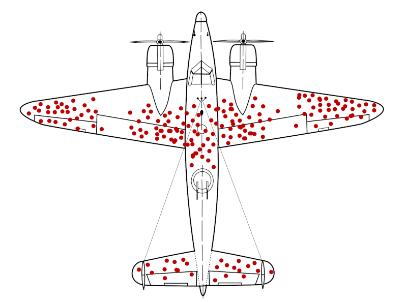
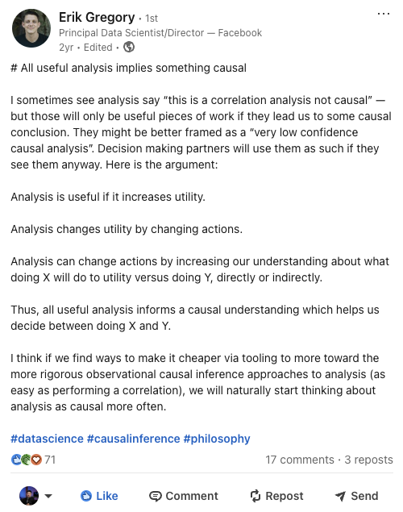
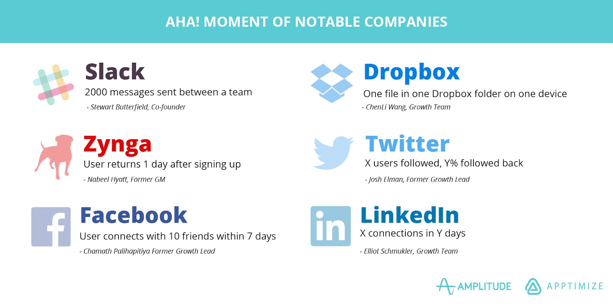

# 怎样想清楚相关和因果的关系

- 原文标题：How to think about the relationship between correlation and causation
- 原文链接：https://www.statsig.com/blog/correlation-vs-causation-guide
- 发布日期：2025-02-27
- 作者：Yuzheng Sun（立正）

「相关不等于因果」，这句话大多数人都听过。

你可能也见过那张讲幸存者偏差的著名图片，觉得自己懂这个道理。可人们还是一直把相关当成因果。

*图1　讲幸存者偏差时常用的示意图：返航飞机上弹孔的分布。这个故事你可能已经听过了。*

比如LinkedIn Premium这条推销，声称能带来「4倍」的主页浏览，这显然更多是相关，而不是因果。也就是说：**主页浏览量本来就高的人，更有可能付钱买Premium。**

*图2　LinkedIn的推销：「Premium会员的主页浏览量平均是普通会员的4倍」。截图来自我的LinkedIn主页。*

LinkedIn这条推销也许是有意误导的广告，但无意中的混淆更危险。这种混淆出现在无数[「aha moment」的说法](https://youtu.be/fuyXA7CXx-o?si=29jyIfkEQnkfo9Gm)里，而这些说法大多站不住。

为什么会有这种混淆？因为人们渴望因果分析。不管正式还是非正式，真正重要的分析就是因果分析。Tom Cunningham在他的文章[Experiment Interpretation and Extrapolation](https://tecunningham.github.io/posts/2023-04-18-experiment-interpretation-extrapolation.html)里说：

> 即使没有随机实验，也没有自然实验（工具变量、断点回归等），人们对自己的决策会带来什么影响，本来就已经知道很多。我们建起了大教堂、飞机和福利国家，让人类的预期寿命翻了一倍，WhatsApp涨到了10亿用户，这些都没有用到随机实验或工具变量估计。
>
> 这些成就都建立在因果推断之上，只不过是*非正式*的因果推断：凭着我们处理信息的本能知识，并没有把假设和分布写下来、算出来。

Erik Gregory在他的[一条LinkedIn帖子](https://www.linkedin.com/posts/erik-gregory-58569a38_datascience-causalinference-philosophy-activity-7022243826119397377-g0VN?utm_source=share&utm_medium=member_desktop&rcm=ACoAAAuOLLAB8lxPx9I-sRxXEg7Yx_YH6SUh1a8)里也提出了相关的观点：所有有用的分析，都隐含着某种因果。

*图3　Erik Gregory的LinkedIn帖子「All useful analysis implies something causal」。他的论证是：分析有用，是因为它增加了效用；分析改变效用，是通过改变行动；分析能改变行动，是因为它让我们更理解做X和做Y分别会带来什么。所以，所有有用的分析都在提供因果上的理解。*

这篇文章用一个简单的公式，讲清楚三件事：1）相关和因果是什么关系；2）造成混淆的主要因素是什么；3）怎样从相关得到因果，不管是用因果推断模型做定量的分析，还是用思维模型做定性的判断。

## 一个简单的公式：相关 ≈ 因果 + 选择偏差

因果推断的方法有很多：双重差分（difference-in-difference）、工具变量、倾向得分匹配、合成控制、断点回归、uplift建模、double ML，等等。也有很多工具和软件包让这些方法用起来更简单。但在底层，它们共享同一个基本思想：

**相关 = 因果 + 选择偏差 + 细枝末节**

为了简单，我们把细枝末节去掉，写成：

**相关 ≈ 因果 + 选择偏差**

记住这个公式，你就可以：

1. **识别出大多数把相关和因果搞混的情况**，并且清楚地知道错误可能从哪里来；
2. **抓住基于观察数据的因果推断模型的本质**，看清楚它们的假设什么时候成立、什么时候不成立。

光是第一点就已经是巨大的优势，因为在这里犯错既常见、代价又高。我们来看一个简单的思想实验。

### 你能看出哪里有误导吗？

假设有一种药，号称能让孩子长得更高，针对15岁的孩子，每周吃一次，吃一年。推销这种药的人给你看了两个数据：

1. 吃了这种药的15岁孩子，一年平均长了3英寸（约7.6厘米）；
2. 在同样的学校里，**没吃**这种药的15岁孩子，一年平均长了2英寸（约5.1厘米）。

*图4　示意图：一瓶「增高药」。*

他们的样本量很大，差异也是统计显著的。这足以证明这种药真的有效吗？

用我们的公式：

**相关 ≈ 因果 + 选择偏差**

虽然吃药和长得更多相关，但这个相关可能来自因果，可能来自选择偏差，也可能两者都有。选择偏差的例子可能是：

1. 有钱的家庭买得起这种药，也能给孩子更好的营养；
2. 选择吃药的家庭更在乎孩子健康成长，还用了别的办法；
3. 选择吃药的家庭，孩子本来就偏矮，所以会有更多「追赶式」的生长。

在每一种情况下，药本身可能什么用都没有，你却仍然会看到统计显著的生长差异。选择偏差有很多不同的名字：混杂因素、潜变量、反向因果、均值回归，等等，但说到底都是同一个意思：两组人之间存在会影响结果的差别，效果并不完全是处理造成的。

## 为什么很多「aha moment」是误导

「aha moment」指的是用户旅程中那个特别的时刻，用户在那一刻领会到了产品的价值。理论上这没问题。麻烦出在人们想把它锁定成一个具体的指标或目标，比如那个著名的说法：[7天内加超过10个好友，是Facebook用户活跃的关键](https://apptimize.com/blog/2016/02/this-is-how-you-find-your-apps-aha-moment/)。

*图5　常被引用的「知名公司的aha moment」：Slack是团队之间发了2000条消息，Dropbox是在一台设备的一个Dropbox文件夹里放了一个文件，Zynga是用户注册后第二天回来，Twitter是关注了X个用户、其中Y%回关，Facebook是7天内加了10个好友，LinkedIn是Y天内建立X个联系。图片来源：Amplitude和Apptimize。*

还是同一个公式：

**相关 ≈ 因果 + 选择偏差**

这里的主要问题是什么？

1. **它们是由用户自己的选择驱动的**：aha moment反映的是用户主动的行为，而这种行为取决于无数隐藏的因素。其中很大的一个，是用户本身有多愿意活跃。意愿强的用户，自然比意愿弱的用户更容易达到这些时刻。
2. **它们和想要的结果高度相关**：这些时刻通常和更高的产品使用量或活跃度一起出现，但这种联系可能是扭曲的。因为是用户自己选择进来的，这就产生了内生性问题，让任何清楚的因果结论都变得模糊。

人们常常以为，正是这些aha moment带来了用户活跃度的大幅提升。但很多时候，你投入大量资源去推高的这个指标，属于那些本来就会活跃的用户。

**看待aha moment更好的方式**是：

1. **把它们当作代理指标**：aha moment是用户意愿的早期预测信号，说明这个人更可能持续活跃或者花钱。它们依然有用，比如用来训练机器学习模型。
2. **用它们让团队围绕一个简单的目标凝聚起来**：「7天10个好友」这样的数字没有魔力。但如果它反映了你的产品运作方式里某种根本的东西，它可以成为整个团队一个好用的基准。

看清这些规律以后，你就能识别出大多数把相关误当成因果的情况，并且对可能存在的选择偏差提出一个有力的假设。只要盯住一个问题：为什么是这些人选择了这个「处理」？罪魁祸首多半就在这里。

## 所有因果推断模型，都是为了去掉选择偏差

根据我们简化的公式：

**相关 ≈ 因果 + 选择偏差**

如果去掉了选择偏差，我们就能从观察到的相关里得出因果结论。主要的难点在于，选择偏差往往是隐藏的，很难直接衡量。

不同的因果推断模型，帮我们用不同的方式处理这个问题。随机对照试验（RCT）、工具变量（IV）、双重差分（DID）以及其他很多方法，都在想办法以各自的方式去掉选择偏差。在我最近做的一次LinkedIn调查里，很多人同意RCT、IV和DID是因果方法的三个大类，其中DID覆盖的范围很广。

如果你有兴趣看一篇梳理常用因果推断模型、并把它们归成这三类的文章，[告诉我](https://www.linkedin.com/in/yuzhengsun/)。以后我们可以发一篇更详细的。

### 最后

在一个数据泛滥的世界里，人很容易抓住那些看起来很有说服力的相关性，但相关性很少能单独证明任何东西。

永远要问一句：这里会不会有选择偏差？如果能排除，很好，你离真正的因果更近了一步。如果排除不了，你可能在追一条错误的线索，把资源投进一件不会产生真实结果的事情里。

说到底，正是我们对因果洞察的渴望，推动了有意义的决策。记住这个简单的公式，清楚选择偏差是怎样悄悄混进来的，你就能分辨出哪些是真正的因果故事，哪些只是打扮成洞察的假线索。
